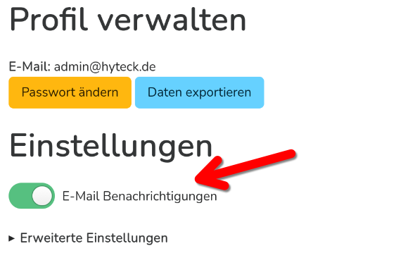
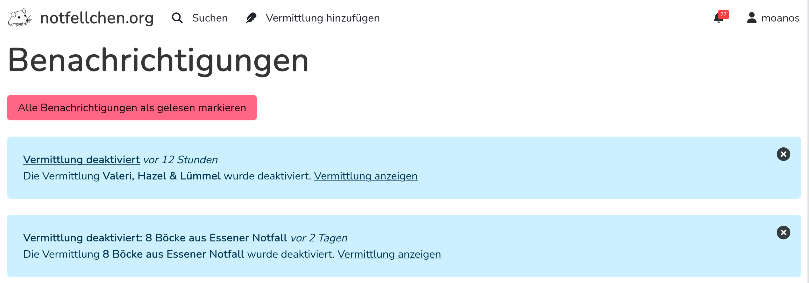

Benachrichtigungen
==================

Ersteller*innen von Vermittlungen werden über neue Kommentare per Mail benachrichtigt, ebenso alle die die Vermittlung abonniert haben.
Jede Vermittlung kann abonniert werden. Dafür klickst du auf die Glocke neben dem Titel der Vermittlung.

.. image:: abonnieren.png

Einstellungen
-------------

Du kannst E-Mail Benachrichtigungen in den Einstellungen deaktivieren.

Auf der Website
+++++++++++++++

E-Mail
++++++

Mit während deiner :doc:`registrierung` gibst du eine E-Mail Adresse an. An diese senden wir Benachrichtigungen, außer
du deaktiviert dies wie oben beschrieben.