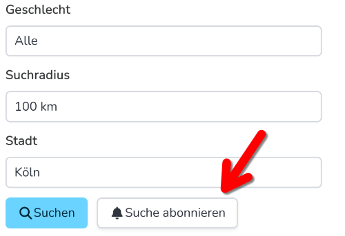

Erste Schritte
==============

Tiere zum Adoptieren suchen
---------------------------

Wenn du Tiere zum adoptieren suchst, brauchst du keinen Account. Du kannst bequem die `Suche <https://notfellchen.org/suchen/>`_ nutzen, um Tiere zur Adoption in deiner Nähe zu finden.
Wenn dich eine Vermittlung interessiert, kannst du folgendes tun

* die Vermittlung aufrufen um Details zu sehen
* den Link :guilabel:`Weitere Informationen` anklicken um auf der Tierheimwebsite mehr zu erfahren
* per Kommentar weitere Informationen erfragen oder hinzufügen

Wenn du die Tiere tatsächlich informieren willst, folge der Anleitung unter :guilabel:`Adoptionsprozess`.
Dieser kann sich je nach Tierschutzorganisation unterscheiden.

.. image::
   screenshot-adoptionsprozess.png
   :alt: Screenshot der Sektion "Adoptionsprozess" einer Vermittlungsanzeige. Der Prozess ist folgendermaßen: 1. Link zu "Weiteren Informationen" prüfen, 2.  Organization kontaktieren, 3. Bei erfolgreicher Vermittlung: Vermittlung als geschlossen melden

Suchen abonnieren
+++++++++++++++++

Es kann sein, dass es in deiner Umgebung keine passenden Tiere für deine Suche gibt. Damit du nicht ständig wieder Suchen musst, gibt es die Funktion "Suche abonnieren".
Wenn du eine Suche abonnierst, wirst du für neue Vermittlungen, die den Kriterien der Suche entsprechen, benachrichtigt.

.. important::

   Um Suchen zu abonnieren brauchst du einen Account. Wie du einen Account erstellst erfährst du hier: :doc:`registrierung`.

.. hint::

   Mehr über Benachrichtigungen findest du hier: :doc:`benachrichtigungen`.

Vermittlungen hinzufügen
------------------------

Gehe zu `Vermittlung hinzufügen <https://notfellchen.org/vermitteln/>`_ um eine neue Vermittlung einzustellen.
Füge alle Informationen die du hast hinzu.

.. important::

   Um Vermittlungen hinzuzufügen brauchst du einen Account.
   Wie du einen Account erstellst erfährst du hier: :doc:`registrierung`.

.. important::

   Vermittlungen die du einstellst müssen erst durch Moderator\*innen freigeschaltet werden. Das passiert normalerweise
   innerhalb von 24 Stunden. Wenn deine Vermittlung dann noch nicht freigeschaltet ist, prüfe bitte dein E-Mail Postfach,
   es könnte sein, dass die Moderator\*innen Rückfragen haben. Melde dich gerne unter info@notfellchen.org, wenn deine
   Vermittlung nach 24 Stunden nicht freigeschaltet ist.

