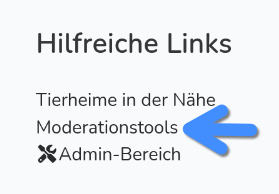
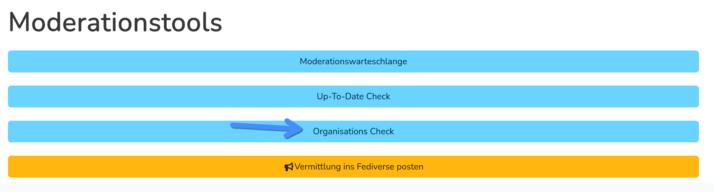

Tiere in Vermittlung systematisch entdecken & eintragen
=======================================================

Notfellchen hat eine Liste der meisten deutschen Tierheime und anderer Tierschutzorganisationen (550, Stand Oktober 2025).
Die meisten dieser Organisationen (412, Stand Oktober 2025) nehmen Tiere auf die bei Notfellchen eingetragen werden können.
Es ist daher das Ziel, diese Organisationen alle zwei Wochen auf neue Tiere zu prüfen.

.. warning::

   Organisationen auf neue Tiere zu prüfen ist eine Funktion für Moderator\*innen. Falls du Lust hast mitzuhelfen,
   meld dich unter info@notfellchen.org

Als Moderator\*in kannst du direkt auf den `Moderations-Check <https://notfellchen.org/organization-check/>`_ zugreifen
oder findest ihn in unter :menuselection:`Hilfreiche Links --> Moderationstools`:

Arbeitsmodus
------------

.. drawio::
   Tiere-in-Vermittlung-entdecken.drawio.html
   Tiere-in-Vermittlung-entdecken.drawio.png

Shortcuts
---------

Um die Prüfung schneller zu gestalten, gibt es eine Reihe von Shortcuts die du nutzen kannst. Aus Gründen der
Übersichtlichkeit sind im Folgenden auch Shortcuts im Browser aufgeführt.

+------------------------------------------------------+---------------+
| Aktion                                               | Shortcut      |
+======================================================+===============+
|  Website der ersten Tierschutzorganisation öffnen    | :kbd:`O`      |
+------------------------------------------------------+---------------+
| Tab schließen (Firefox/Chrome)                       | :kbd:`STRG+W` |
+------------------------------------------------------+---------------+
| Erste Tierschutzorganisationa als geprüft markieren  | :kbd:`C`      |
+------------------------------------------------------+---------------+